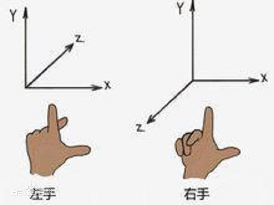

# BasicScene

创建一个逻辑最简单的场景需要用到以下的 API

- `Scene` 场景
- - `Geometry` 几何图形
- - `Material` 图形材质
- - `Mesh` 网格（用于图形渲染）
- `Camera` 摄像头
- `Canavas` `html` 节点，提供给 `js` 渲染使用
- `Renderer` 渲染器（把场景和摄像头以及 `canvas` 节点交给渲染器放到 `html` 页面上）

[Three.js官方的示例文档](https://threejs.org/docs/#manual/zh/introduction/Creating-a-scene)

需要注意的是在物体和摄像头设置好后，他们其实是在一个中心点，所以我们看到的画面是一片黑色，所以我们要把物体移动的远一点， `Three.js` 使用的是左手坐标系，所以我们要需要修改物体的 `z` 轴的坐标

