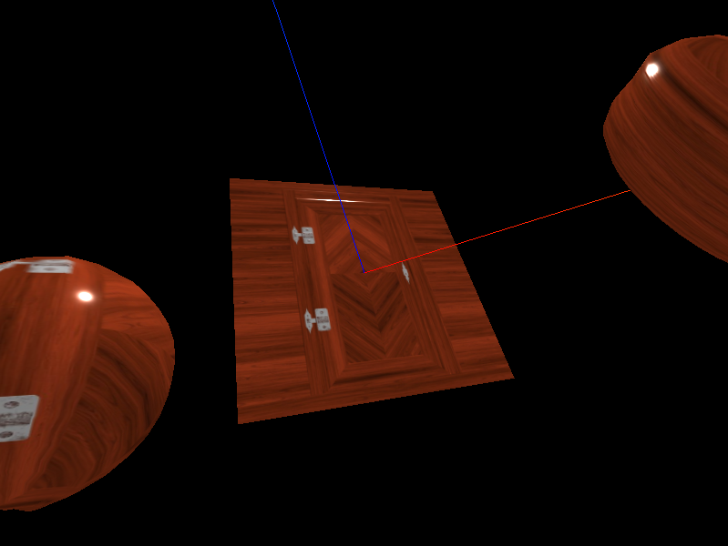
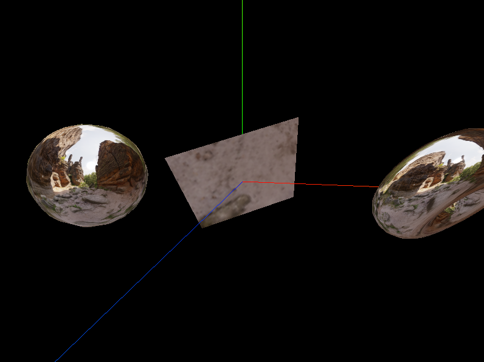

# Material

`Materials` 是用来给几何体的每个可见像素上色的， 这里主要对 `MeshStandardMaterial` 进行介绍

## MeshStandardMaterial 标准网格材质

`MeshStandardMaterial` 是基于物理渲染的（physically based rendering, PBR）。它支持光效，并有一个更拟真的算法，支持了更多参数如粗糙度、金属性。
之所以是 `Standard` 因为 `PBR` 已经在很多软件、引擎和库里成为一种标准。
这种方法与旧方法的不同之处在于，不使用近似值来表示光与表面的相互作用，而是使用物理上正确的模型。 我们的想法是，不是在特定照明下调整材质以使其看起来很好，而是可以创建一种材质，能够“正确”地应对所有光照场景。
在实践中，该材质提供了比 `MeshLambertMaterial` 或 `MeshPhongMaterial` 更精确和逼真的结果，代价是计算成本更高。
计算着色的方式与 `MeshPhongMaterial` 相同，都使用 `Phong` 着色模型， 这会计算每个像素的阴影（即在 `fragment shader`， `AKA pixel shader` 中）， 与 `MeshLambertMaterial` 使用的 `Gouraud` 模型相比，该模型的结果更准确，但代价是牺牲一些性能。

### .metalness : Float

材质与金属的相似度。非金属材质，如木材或石材，使用 0.0，金属使用 1.0，通常没有中间值。 默认值为 0.0。0.0 到 1.0 之间的值可用于生锈金属的外观。如果还提供了 metalnessMap，则两个值相乘。

### .roughness : Float

材质的粗糙程度。0.0 表示平滑的镜面反射，1.0 表示完全漫反射。默认值为 1.0。如果还提供 roughnessMap，则两个值相乘。

### .map : Texture

颜色贴图。默认为 `null`。纹理贴图颜色由漫反射颜色 `.color` 调节。

### .aoMap : Texture

`ambient occlusion map`，该纹理的红色通道用作环境遮挡贴图。默认值为 `null`。`aoMap` 需要第二组 `UV`。

### .aoMapIntensity : Float

环境遮挡效果的强度。默认值为 1。零是不遮挡效果。

增加一个 `debug` 项 `aoMapIntensity`，可以更直观的看到阴影效果强度。

### .displacementMap : Texture

位移贴图会影响网格顶点的位置，与仅影响材质的光照和阴影的其他贴图不同，移位的顶点可以投射阴影，阻挡其他对象， 以及充当真实的几何体。位移纹理是指：网格的所有顶点被映射为图像中每个像素的值（白色是最高的），并且被重定位。

### .displacementScale : Float

位移贴图对网格的影响程度（黑色是无位移，白色是最大位移）。如果没有设置位移贴图，则不会应用此值。默认值为 1。

### .metalnessMap : Texture

该纹理的蓝色通道用于改变材质的金属度。

### .roughnessMap : Texture

该纹理的绿色通道用于改变材质的粗糙度。

使用 `metalnessMap` 和 `roughnessMap` 代替 `metalness` `roughness`

### .normalMap : Texture

用于创建法线贴图的纹理。`RGB` 值会影响每个像素片段的曲面法线，并更改颜色照亮的方式。法线贴图不会改变曲面的实际形状，只会改变光照。

### .normalScale : Vector2

法线贴图对材质的影响程度。典型范围是 `0-1`。默认值是 `Vector2` 设置为（1,1）。

### .alphaMap : Texture

`alpha` 贴图是一张灰度纹理，用于控制整个表面的不透明度。（黑色：完全透明；白色：完全不透明）。 默认值为 `null`。

## Environment map

环境贴图，在几何体上用于反射出周围环境的一种纹理贴图。

# 资源

- [一个材质素材很多的网站](https://polyhaven.com/)
- [一个把材质 HDRI 文件转换成上下左右前后 6 张图片的网站](https://matheowis.github.io/HDRI-to-CubeMap/)
