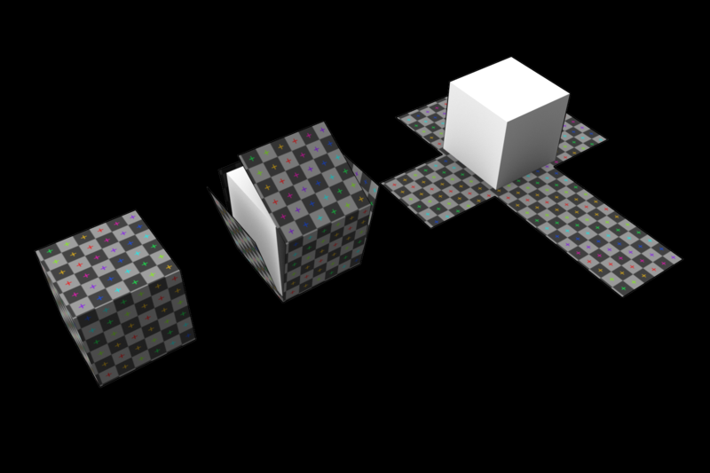

# Textures

纹理是覆盖在几何体表面的图片，当把纹理按照特定的方式映射到物体表面上的时候能使物体看上去更加真实。

我们之前一直用一个红色的正方体来做演示 `demo`，现在可以改变一下他的纹理

```ts
// Red cube
const geometry = new THREE.BoxGeometry(1, 1, 1);
const texture = new THREE.TextureLoader().load(baseDoor);
// texture.minFilter = THREE.NearestFilter;
const material = new THREE.MeshBasicMaterial({ map: texture });
const mesh = new THREE.Mesh(geometry, material);
scene.add(mesh);
```

纹理对象有很多的 `filter` 过滤器，不同的过滤器展示出来的纹理效果不同

# UV unwrapping

`UV unwrapping` 是纹理在被放置在模型上的具体对应位置的控制，控制纹理拉伸的位置和方向等。字母 `U` 和 `V` 表示 2D 纹理的轴，因为 `X`、`Y` 和 `Z` 已经用于表示模型空间中 3D 对象的轴，而 `W`（在 除了 XYZ) 用于计算四元数旋转，这是计算机图形学中的常见操作。



# 资源

收集到的几个纹理网站

- [poliigon.com](https://www.poliigon.com/)
- [3dtextures.me](https://3dtextures.me/)
- [arroway-textures.ch](https://www.arroway-textures.ch/)
